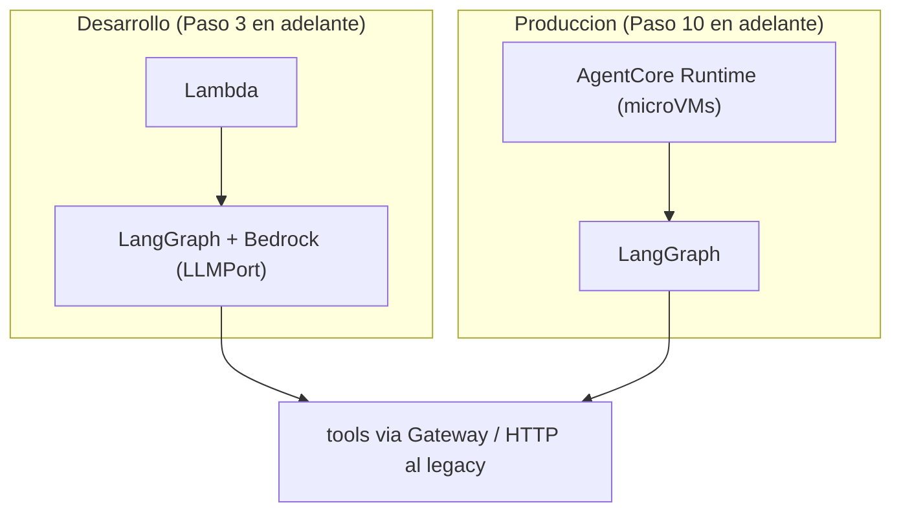

# Bedrock AgentCore

Documento de arquitectura (Fase 1). Qué es AgentCore, qué entra en él y qué sigue en Lambda. Decisión de fondo: D4 (desarrollo = LangGraph + Bedrock en Lambda; producción = AgentCore con adopción modular).

Ver también: [MULTI_TENANCY.md](./MULTI_TENANCY.md), [INTEGRATION_WITH_LEGACY.md](./INTEGRATION_WITH_LEGACY.md), [ADR 0004](../adr/0004-orquestacion-langgraph-agentcore-modular.md).

## 1. Qué es y qué NO es

AgentCore es el conjunto de servicios managed de Amazon Bedrock para **ejecutar, recordar, conectar y gobernar** agentes. En este proyecto:

- **NO reemplaza a LangGraph.** LangGraph sigue siendo la orquestación (grafo de nodos, edges, estado). AgentCore es la plataforma donde ese grafo se ejecuta, se recuerda y se autoriza (D4). No se elige entre uno y otro: **AgentCore ejecuta LangGraph**.
- **NO es la fuente de verdad de nada.** Precios, stock, disponibilidad, estado de pedido y horas viven en el backend legacy; el contexto operacional reciente vive en DynamoDB; el conocimiento de RAG vive en Aurora.
- **NO se activa todo el día 1.** Se adopta por módulos, en el orden Runtime → Memory → Gateway → Identity + Policy (sección 4).

El mismo grafo, las mismas tools y los mismos contratos en ambos caminos; cambia el runner, no el código de los slices.

## 2. Componentes

### 2.1 Runtime

- Hosting serverless de agentes, con ejecución en microVMs y **sesiones aisladas** entre sí.
- Duración máxima de sesión → `TODO(verify)`; estado efímero de sesión (scratchpad, mensajes en curso) vive aquí y **se pierde** al cerrar la sesión: nada durable se guarda sólo en Runtime.
- En desarrollo el mismo grafo corre en una Lambda con Bedrock (`src/adapters/bedrock` + `LLMPort`); en producción corre en Runtime. El código del grafo es el mismo en ambos casos.

### 2.2 Memory

- Memoria **entre sesiones**: resumen de conversación previa, preferencias del cliente, hechos estables (p. ej. "pide sin cebolla").
- **No es fuente de verdad operacional.** Nunca responde por estado de pedido, precio ni disponibilidad; eso se consulta a las tools (D2). Si Memory y el legacy discrepan, manda el legacy.
- Políticas de retención de Memory se alinean con D6 (retención de conversaciones, ADR 0007, Pendiente) → `TODO(verify)`.

### 2.3 Gateway

- Expone las **APIs internas del legacy** como tools del agente: recibe una definición de API (incluidas Lambdas) y la convierte en una **tool MCP** con su schema.
- Es la pieza que hace real D2: el LLM nunca toca la base de datos; sólo invoca tools publicadas aquí, con schema, validación, autorización por tenant, timeout, idempotencia y logs.
- El descubrimiento automático desde la especificación de la API y el formato exacto de publicación → `TODO(verify)`.

### 2.4 Identity

- Identidad **del agente** ante el mundo: con quién es él.
- **Entrante**: cómo se autentica quien invoca al agente (IAM u OAuth) → `TODO(verify)` mecanismos soportados.
- **Saliente**: credenciales con las que el agente llama APIs de terceros y del legacy (rotación y almacenamiento de secretos incluidos) → `TODO(verify)`.

### 2.5 Policy

- Autorizaciones sobre **tools**: qué tool puede correr el agente, con qué parámetros y en qué contexto. Autorizador basado en **Cedar/Dogwood**.
- Principios: **default-deny** (sin política explícita, no hay permiso) y **forbid-wins** (si alguna política prohíbe, gana la prohibición aunque otra permita).
- El schema de las políticas se **autogenera desde el Gateway**: si una tool no está publicada allí, no existe para la política.
- Sesiones de política (crear/editar/versionar antes de aplicarse) → `TODO(verify)`.
- Ejemplo canónico de las reglas de seguridad: cambiar la hora de un pedido está prohibido en (1) tool inexistente para el LLM, (2) dominio `Order`, (3) **esta capa**, (4) Guardrails, (5) test de regresión.

## 3. Qué va en AgentCore y qué permanece en Lambda

| Responsabilidad | Dónde corre | Por qué |
|---|---|---|
| Orquestación LangGraph (grafo) | Lambda en dev / **AgentCore Runtime** en prod | En dev priorizamos iterar sin plataforma nueva; en prod ganamos sesiones aisladas y ejecución managed |
| Checkpointer de corto plazo (estado de la conversación en curso) | **DynamoDB** | Estado operacional propio, consultable y depurable por nosotros, con `tenant_id` en la clave; AgentCore no lo necesita para funcionar |
| Memoria a largo plazo (entre sesiones) | **AgentCore Memory** | Servicio managed pensado justo para eso; en Lambda nos tocaría resumir y persistir a mano |
| Tools de negocio contra el legacy | **AgentCore Gateway** | Una sola publicación, con schema, rate limits y trazabilidad, en vez de código ad-hoc de HTTP en cada slice |
| Autorización de tools (incl. por tenant) | **AgentCore Policy** | Default-deny y forbid-wins centralizados; el código no puede "olvidarse" de validar |
| Identidad del agente (entrante/saliente) | **AgentCore Identity** | Ciclo de vida de credenciales fuera de nuestro código |
| Webhook Meta y gateway de canal (verificación, firma, encolado) | **Lambda** | Entrada HTTP puntual y de corta duración; no aporta nada tenerla en AgentCore y sí complica el despliegue por tenant (D1) |
| RAG (búsqueda semántica) | **Lambda** consultando Aurora + pgvector | Sólo requiere una query con filtro por tenant; no justifica otro servicio |

## 4. Adopción modular alineada a la ruta (ROADMAP)

Orden de adopción (D4): Runtime → Memory → Gateway → Identity + Policy. Nunca todos a la vez.

| Paso | Qué se activa | Qué se gana | Qué se paga |
|---|---|---|---|
| Pasos 3–5 | **Nada de AgentCore.** LangGraph + Bedrock en Lambda (`conversation_gateway`, `supervisor`, `customer_context`) | Menor operación y menor costo: cero plataforma nueva que aprender, cero services que monitorear | Autorización de tools y manejo de sesiones a mano, en código |
| Paso 10 | **Runtime + Memory** (el grafo migra de Lambda a Runtime) | Sesiones aisladas y memoria entre sesiones gestionadas | Más componentes a operar y facturación nueva por uso → `TODO(verify pricing)` |
| Paso 11 | **Gateway + Policy** (tools de `appointments` y `orders` publicadas contra el legacy, con el grafo ya en Runtime) | Autorización centralizada y schema autogenerado; el contrato de tools queda listo antes de publicar nada | Un servicio más en escena, políticas que hay que versionar y probar |
| Paso 12 | **Identity** (identidad entrante/saliente) | Credenciales fuera de nuestro código | Rotación de credenciales sin redeploy |

El salto de los Pasos 3–5 al Paso 10 es "menos operación propia, más servicio managed"; el del Paso 10 al 11 añade "más gobernanza, mismo runtime"; el Paso 12 saca las credenciales de nuestro código. Todo se decide con métricas de los pasos anteriores, no por defecto.

Criterios para activar el siguiente componente:

1. El componente anterior lleva una fase estable en producción, sin incidentes de aislamiento por tenant.
2. Existe una necesidad concreta que hoy resolvemos a mano (p. ej. credenciales rotándose en código → Identity).
3. El costo estimado del servicio managed es menor que el costo de operarlo nosotros → `TODO(verify pricing)`.
4. El módulo Terraform correspondiente ya tiene sus resources verificados (sección 6).
5. Hay rollback definido: el grafo puede volver a Lambda sin cambiar los contratos de los slices.

## 5. Costos, lock-in y mitigaciones

- **Costo**: cada componente añade su propia facturación (ejecución de sesiones, memoria, llamadas a tools). Precios → `TODO(verify pricing)`. Regla de decisión: se activa un componente sólo si el costo de operarlo nosotros supera su costo managed (tabla de la sección 4).
- **Lock-in**:
  - El **grafo y la lógica** son LangGraph, framework abierto: se pueden ejecutar en Lambda, en un contenedor o en cualquier otro runner.
  - Todas las capacidades externas se consumen tras **puertos** en `src/shared/ports` (`LLMPort`, `VectorStorePort`, `MemoryStorePort`, `ClockPort`, `EventBusPort`) y adapters en `src/adapters/`: cambiar de runner o de proveedor de memoria es sustituir un adapter, no reescribir slices.
  - La infraestructura de AgentCore vive en el módulo propio `infra/modules/agentcore`, aislada del resto: se puede destruir sin tocar las Lambdas.
  - Las tools se definen en código de este repo; si mañana no usamos Gateway, republicamos las mismas firmas desde Lambda.

## 6. Pendientes de infraestructura (`infra/modules/agentcore`)

El módulo está vacío (esqueleto). Los resources candidatos del provider de Terraform **aún no están verificados** contra la documentación oficial:

| Recurso candidato | Propósito | Estado |
|---|---|---|
| Runtime (agente/endpoint de ejecución) | Hostear el grafo en prod (Paso 10) | `TODO(verify)` resource y argumentos |
| Memory | Memoria entre sesiones (Paso 10) | `TODO(verify)` resource y argumentos |
| Gateway (apis → tools MCP) | Publicar tools del legacy (Paso 11) | `TODO(verify)` resource y argumentos |
| Identity | Identidad entrante/saliente (Paso 12) | `TODO(verify)` resource y argumentos |
| Policy (Cedar/Dogwood) y policy session | Autorización de tools (Paso 11) | `TODO(verify)` resource y argumentos |
| Permisos/roles asociados | Vincular con `infra/modules/iam` | `TODO(verify)` |

Ninguno de estos resources se declara hasta verificar su existencia y soporte en el provider; hasta entonces el módulo sólo documenta intención.

## 7. Referencias

- [ADR 0004 — Orquestación LangGraph + AgentCore modular](../adr/0004-orquestacion-langgraph-agentcore-modular.md)
- [MULTI_TENANCY.md](./MULTI_TENANCY.md) (cómo aplica el filtro por tenant sobre las tools de Gateway/Policy)
- [INTEGRATION_WITH_LEGACY.md](./INTEGRATION_WITH_LEGACY.md) (qué APIs publica el Gateway)
- [`../../AGENTS.md`](../../AGENTS.md)
