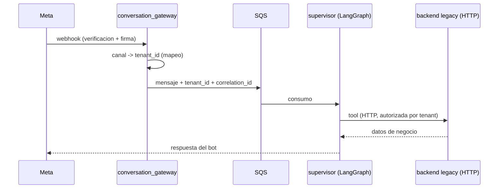

# Integración con el backend legacy (`sahagunonline/back`)

Documento de arquitectura (Fase 1). Este sistema **convive** con el backend legacy y lo **sustituye de forma gradual** (D1): no hay migración de un día para otro ni "big bang". Mientras un comercio no corte, el legacy sigue atendiendo su tráfico exactamente como hoy.

Ver también: [MULTI_TENANCY.md](./MULTI_TENANCY.md), [AGENTCORE.md](./AGENTCORE.md), [ADR 0004](../adr/0004-orquestacion-langgraph-agentcore-modular.md) y [`../../AGENTS.md`](../../AGENTS.md).

## 1. Objetivo

1. **Convivencia**: ambos sistemas se ejecutan a la vez, diferenciados por comercio (tenant), sin duplicar lógica de negocio.
2. **Reemplazo gradual**: primero el canal de chat/WhatsApp, después el resto del camino conversacional; comercio por comercio.
3. **Acoplamiento mínimo**: este repo habla con el legacy **sólo por HTTP**, tras `src/adapters/legacy_backend`. Nunca importa su código ni consulta su tabla directamente (una única excepción, sección 7).

## 2. Servicios legacy relevantes

| Servicio legacy | Rol hoy | Qué lo sustituye aquí | Paso |
|---|---|---|---|
| `whatsapp_webhook_service` | Recibe el webhook Meta, valida firma y encola en SQS | `conversation_gateway` (webhook completo: `hub.challenge`, `X-Hub-Signature-256`, SQS) | 9 |
| `whatsapp_orchestrator_service` | SQS → LangGraph (~1700 líneas), con tools directas contra DynamoDB (`search_products`, `get_menu`) | `supervisor` + tools vía AgentCore Gateway (D2): el LLM nunca toca la base de datos | 4 → 11 |
| `ai_chat_service` | Chatbot con Step Functions | `supervisor` (LangGraph), sin Step Functions | 4 |
| `tenant_service` | Config de comercio: branding, `allowed_bots`, `menu_images` | Se **consulta** por HTTP; no se duplica (fuente de verdad = legacy) | 4 |
| `sales_service` | Pedidos y mesas | Slice `orders` (tools `search_products`, `get_menu`, `get_order_status`, `propose_order`) | 5 |
| `product_service` | Catálogo de productos | Slice `knowledge_rag` (réplica a Aurora para RAG) + tools `search_products`/`get_menu` vía HTTP | 5 → 7 |
| `ops_service` | Reservas y citas | Slice `appointments` (tools `get_availability`, `propose_appointment`, `cancel_appointment`) | 5 |

Los nombres de los servicios son los del legacy; sus endpoints exactos se levantaron en
el Paso 5 (sección 4) desde `docs/catalogo_endpoints.md` y el código fuente del legacy.

## 3. Flujo actual vs. flujo futuro (webhook Meta)

**Etapa actual (antes del corte de un comercio):**

1. Meta → `whatsapp_webhook_service` (legacy) → SQS → `whatsapp_orchestrator_service` → tools directas contra DynamoDB → respuesta.
2. Este sistema **no toca** el tráfico de ese comercio.

**Etapa futura (después del corte, por tenant):**

1. Meta → `conversation_gateway` (este repo): verifica `hub.challenge`, valida firma, resuelve `tenant_id` desde el mapeo de canal, encola en SQS.
2. `supervisor` ejecuta LangGraph con Bedrock: prompts por tenant (`tenant_prompts`), RAG (`knowledge_rag`), tools de negocio publicadas en AgentCore Gateway contra el legacy.
3. El legacy sigue siendo la fuente de verdad de datos; sólo cambia quién conversa con el cliente.

**¿Quién recibe el webhook Meta en cada etapa?** Al inicio: el legacy, para todos los comercios. Luego: el legacy para los comercios pendientes y `conversation_gateway` para los ya migrados. La **conmutación es por número de teléfono / WABA** (un número apunta a un sistema o al otro, comercial a comercial) → `TODO(verify)` (mecanismo exacto de conmutación, quién la ejecuta y cómo se propaga el cambio en Meta).

## 4. Contrato de tools hacia el legacy

Endpoints **levantados en el Paso 5** leyendo `docs/catalogo_endpoints.md` del repo
legacy y verificando el código fuente (`src/sales_service/app.py`,
`src/product_service/app.py`, `src/ops_service/app.py` y `src/tenant_service/app.py`;
revisión del 2026-10-09). Cada tool = un endpoint HTTP del legacy + schema +
autorización por tenant + timeout + idempotencia + logs. Todo lo que no se pudo
confirmar en el código queda marcado `TODO(verify)`: ninguna ruta se "inventa".

| Tool (este repo) | Caso de uso | Servicio legacy | Endpoint exacto | Notas / `TODO(verify)` |
|---|---|---|---|---|
| `search_products` | Búsqueda por texto en el catálogo | `product_service` (5003) | `GET /public/products?store_id=<tenant_id>` | El legacy **no** expone un endpoint de búsqueda: la filtraría el cliente sobre la vista pública → `TODO(verify)` (¿filtro aquí o endpoint nuevo?) |
| `get_menu` | Menú e imágenes del comercio | `product_service` (5003) | `GET /public/products?store_id=<tenant_id>&with_image=true` | Devuelve sólo productos `ACTIVO` del `store_id`; vista pública sin costos |
| `get_order_status` | Estado de un pedido | `sales_service` (5002) | `GET /orders/<order_id>` | **Sin filtro de tenant en la ruta**: hay que verificar que el pedido sea del comercio → `TODO(verify)` (¿el legacy valida store o devuelve 404/ajeno?); alternativa de mesa: `GET /store/<store_id>/table/<table_id>/active-order` |
| `propose_order` | Crear pedido | `sales_service` (5002) | `POST /orders/append` | Única ruta de creación (append a pedido abierto; «Used by both normal API and WhatsApp bot»); body `AppendOrderInput` (`store_id`, `mesa_id`, `order_type`, `items`); no existe `POST /orders` → `TODO(verify)` (flujo chat/domicilio y qué campos usa el bot) |
| `get_availability` | Huecos libres del día | `ops_service` (5004) | `GET /appointments/availability?date=<fecha>&employee_id=<id>` | Exige `employee_id` y devuelve huecos 08:00–18:00 menos los reservados → `TODO(verify)` (cómo se resuelve el empleado por defecto del comercio; `get_availability` del repo no recibe employee) |
| `propose_appointment` | Agendar cita | `ops_service` (5004) | `POST /appointments` | Body `AppointmentInput`: `date_iso` ISO 8601 estricto, `customer_id`/`customer_name`/`customer_phone`, `employee_id`/`employee_name`/`employee_role`, `service_id`/`service_name`; `TODO(verify)` (mapeo de nuestros campos a estos: date+time → `date_iso`, contact → customer, empleado/servicio por defecto) |
| `cancel_appointment` | Cancelar cita | `ops_service` (5004) | `DELETE /bookings/<booking_id>?doctor_id=<id>` | Requiere `doctor_id` y opera sobre bookings → `TODO(verify)` (que las citas creadas por `/appointments` se cancelan por esta vía); alternativa: `PUT /bookings/<id>` con `status` |
| `get_opening_hours` | Horarios de atención | `tenant_service` (5006) | `business_hours` en `CONFIG#COMMERCE` | El único endpoint público, `GET /public/config/<org_id>`, devuelve **sólo** `branding` → `TODO(verify)` (endpoint de horarios sin auth, o servirlos desde RAG) |

El `tenant_id` del legacy sale de distintos sitios según el servicio: en `ops_service`
de los claims del **authorizer** (`get_tenant_id()`), en `product_service` del query
`store_id` y en `sales_service` del body (`AppendOrderInput.store_id`) o de la ruta.
Ese mapeo (y la validación de que coincida con el contexto resuelto aquí) es parte del
`TODO(verify)` de la sección 5.

Tools de **escritura** (`propose_order`, `propose_appointment`, `cancel_appointment`)
exigen idempotencia por `correlation_id` → `TODO(verify)` (mecanismo: ¿header del
legacy, o lock propio en `order_locks`/`appointment_locks`, Paso 6). El ejemplo canónico
de las reglas de seguridad es el reverso: para "modificar la hora de un pedido" la tool
**no existe**.

## 5. Autenticación sistema → legacy

| Etapa | Mecanismo | Estado |
|---|---|---|
| Hoy (legacy interno) | Header `x-internal-call: true` entre Lambdas del propio legacy | Conocido, en uso |
| Este sistema | Llamadas salientes a los endpoints del legacy autenticadas | `TODO(verify)` (opciones: conservar `x-internal-call` restringido por red/IAM, API key gestionada, o credenciales vía AgentCore Identity) |

Regla mientras se verifica: **no se inventa credencial ni header nuevo**; toda llamada sale por `src/adapters/legacy_backend`, que es el único punto donde se decide el mecanismo. Cuando Active Identity (Paso 12), las credenciales salientes viven allí.

## 6. Identificadores compartidos

| Identificador | Valor | Quién lo resuelve |
|---|---|---|
| `tenant_id` | `store_id` del legacy (p. ej. `"Sede_Elite_01"`) | `conversation_gateway`, desde el mapeo de canal (D5) |
| `from_number` | Número/identificador Meta del cliente; es la clave natural de cliente en todas las tools | El gateway del canal; se pasa tal cual al legacy |
| `allowed_bots` | Entitlements de bots (`sales`, `appointments`, ...) en `CONFIG#COMMERCE` | Legacy (fuente de verdad); este repo sólo los respeta |
| Branding | `display_name`, `primary_domain`, `menu_images` en `ORG#{tenant_id}` / `CONFIG#COMMERCE` | Legacy; este repo los lee para personalizar prompts (locales hasta `tenant_prompts`, fuera de la ruta) |
| Mapeo de canal | `WA_CONFIG#{phone_number_id}` → `store_id` | Legacy; **replicado** aquí (sección 7) |

Cualquier divergencia entre identificadores (p. ej. un `store_id` que no existe en el legacy) se trata como error de configuración del tenant: se deniega la conversación y se alerta, nunca se "adivina".

## 7. Estrategia de migración por comercio

1. **Bandera por número**: cada comercio se activa con un flag/ruta que apunta su número de teléfono o WABA a `conversation_gateway`. El mecanismo concreto → `TODO(verify)` (sección 3).
2. **Orden**: primero `supervisor` + `customer_context` (Paso 4), luego tools de negocio (Paso 5) y RAG (Paso 7), y por último `conversation_gateway` (Paso 9).
3. **Criterios de corte** (todos cumplidos antes de migrar al siguiente comercio): firma y `hub.challenge` funcionando con tráfico real, evals del Paso 14 en verde para ese tenant, cero errores de aislamiento, criterios de aceptación acordados con el comercio.
4. **Rollback**: se devuelve el número al orquestador legacy (bandera en off). El legacy nunca se apaga mientras quede un comercio sin migrar; su estado se conserva porque los datos son suyos.
5. **Retroceso de datos**: este repo no escribe en las tablas de negocio del legacy (salvo las escrituras que el propio legacy exponga por API), por lo que un rollback no deja datos huérfanos.

## 8. Acoplamiento permitido y prohibido

**Permitido:**

- HTTP hacia el legacy, exclusivamente a través de `src/adapters/legacy_backend` (adapter único, con timeout, reintentos, logs con `tenant_id` y `correlation_id`).
- Réplica del **mapeo de canal** (`WA_CONFIG`/`IG_CONFIG`/`FB_CONFIG`) a este sistema: **excepción declarada** a la regla de no tocar su tabla, necesaria para resolver el tenant → `TODO(verify)` (mecanismo y frecuencia de replicación; ver [MULTI_TENANCY.md](./MULTI_TENANCY.md) sección 2).
- Réplica del **catálogo** a Aurora para RAG, generada desde los endpoints del legacy, nunca desde su DynamoDB.

**Prohibido:**

- Importar o copiar código del legacy (`sahagunonline/back`) a este repo.
- Leer o escribir directamente su tabla DynamoDB (salvo la excepción de la sección).
- Duplicar reglas de negocio del legacy en prompts: las reglas viven en `domain/` de este repo y en el legacy; los prompts sólo guían la redacción.
- Asumir cabeceras o parámetros del legacy sin verificarlos (todo lo no confirmado es `TODO(verify)`).

## 9. Documentación del legacy a consultar

En el repo hermano `sahagunonline/back`:

| Documento | Para qué |
|---|---|
| `AGENTS.md` | Convenciones, estructura y reglas del equipo legacy |
| `docs/catalogo_endpoints.md` | Endpoints exactos de catálogo, pedidos y citas (base de la tabla de la sección 4, Pasos 5 y 11) |
| `docs/Architecture.md` | Arquitectura general, tablas y flujos existentes |

Si este repo y el legacy discrepan en un hecho verificable, manda el legacy: es quien tiene los datos y el tráfico en producción.

## 10. Referencias

- [MULTI_TENANCY.md](./MULTI_TENANCY.md)
- [AGENTCORE.md](./AGENTCORE.md)
- [ADR 0004 — Orquestación LangGraph + AgentCore modular](../adr/0004-orquestacion-langgraph-agentcore-modular.md)
- [`../../AGENTS.md`](../../AGENTS.md)
