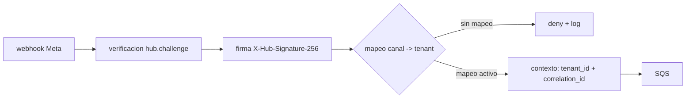

# Multi-tenancy

Documento de arquitectura (Fase 1). Define cómo se identifica, propaga y aísla el `tenant_id` en toda la plataforma. Decisiones relacionadas: D2 (datos de negocio) y D5 (`tenant_id` = `store_id` legado).

Ver también: [AGENTCORE.md](./AGENTCORE.md), [INTEGRATION_WITH_LEGACY.md](./INTEGRATION_WITH_LEGACY.md), [ADR 0004](../adr/0004-orquestacion-langgraph-agentcore-modular.md) y [`../../AGENTS.md`](../../AGENTS.md).

## 1. Modelo de tenancy

**Un tenant = un comercio.** No hay tenant por usuario, por canal ni por conversación: el canal y la conversación son atributos *dentro* de un tenant.

| Dimensión | Decisión |
|---|---|
| Identidad del tenant | `tenant_id` = `store_id` del backend legacy, string con formato libre (p. ej. `"Sede_Elite_01"`). No se reformatea ni se normaliza a UUID: se usa tal cual llega del legacy. |
| Granularidad | Un comercio (tienda/sede) es el límite de aislamiento. Una misma persona escribiendo por dos canales distintos sigue siendo el mismo cliente *dentro* del mismo tenant. |
| Volumen esperado | 3 comercios activos en la plataforma legacy; el chatbot aún tiene 0, por lo que la escala es baja. El diseño no asume volumen alto, pero sí asume aislamiento estricto desde la primera línea de código. |
| Super-tenants | No existen. Ningún rol propio de este sistema lee datos de otro tenant. Los agregados administrativos cruzados (si algún día se necesitan) se resolverán fuera del camino crítico de conversación. |
| Datos de negocio | Cada fila, objeto y respuesta lleva `tenant_id` o vive bajo su clave/prefijo (sección 4). Copiado o exportado fuera de esos límites sólo con retención/archivo (D6, ADR 0007, estado Pendiente). |

## 2. Resolución del tenant en el gateway

El tenant **nunca** llega en el payload del cliente. Se resuelve una sola vez, en `conversation_gateway`, a partir del canal por el que entró el mensaje:

1. Meta envía el webhook a `conversation_gateway`: verificación `hub.challenge`, validación de firma `X-Hub-Signature-256` y encolado en SQS (D1).
2. El gateway identifica el **canal** (`whatsapp` / `instagram` / `messenger`) y el **identificador de emisor Meta** (`phone_number_id` para WhatsApp; los equivalentes de Instagram y Messenger → `TODO(verify)`).
3. Con ese identificador consulta el mapeo de canal → comercio:
   - WhatsApp: `WA_CONFIG#{phone_number_id}` → `store_id` + `access_token` (clave heredada del legacy).
   - Instagram y Messenger: claves equivalentes en el legacy (`IG_CONFIG`, `FB_CONFIG` → `TODO(verify)` nombres exactos).
4. Si no hay mapeo o el mapeo está inactivo: **rechazo** con log estructurado (`action=deny`, `reason=unmapped_channel`) y sin consumir más recursos. No se resuelve "el tenant más probable".
5. Una vez resuelto, el `tenant_id` se fija en el contexto (sección 3) *antes* de cualquier paso asíncrono; todo lo que se encole en SQS arrastra `tenant_id` + `correlation_id` en el mensaje.

**Replicación del mapeo.** Este repo no debe leer la tabla del legacy en línea en cada webhook. El mapeo de canal se replica a nuestro lado con un mecanismo propio (export periódico, cambio de canal o lectura puntual) → `TODO(verify)` (frecuencia, formato y mecanismo exacto de replicación). Esta réplica del mapeo de canal es la **única** excepción permitida de datos del legacy almacenados aquí; ver [INTEGRATION_WITH_LEGACY.md](./INTEGRATION_WITH_LEGACY.md) sección 7.

## 3. Propagación del contexto

| Pieza | Ubicación | Regla |
|---|---|---|
| Contexto | `src/shared/context` (`contextvars`) | `TenantContext` con `tenant_id`, `correlation_id`, `channel` y `customer_id`. Se setea al entrar al handler y se limpia al salir (`reset`), para no filtrar estado entre invocaciones de Lambda. |
| Correlación | `correlation_id` | Se genera (o se toma de Meta) en el gateway y viaja en cada mensaje SQS, en cada respuesta HTTP saliente y en cada log. Su nombre/transporte exacto hacia el legacy → `TODO(verify)`. |
| Logs | `src/shared/logging` | JSON por línea, con `tenant_id` y `correlation_id` obligatorios. Un log sin `tenant_id` se considera un bug del logger, no un caso aceptable. |
| Trabajo asíncrono | Lambdas / colas | El `contextvar` **no** viaja solo: cada mensaje de SQS arrastra `tenant_id` explícito; el consumidor lo rehidrata en el contexto al inicio. |
| Pasado entre procesos | Contratos | Cualquier payload que cruce un límite de proceso (SQS, HTTP, eventos) usa un modelo de `src/shared/contracts` que incluye `tenant_id` como campo requerido. |

## 4. Filtrado obligatorio por capa de datos

| Almacén | Mecanismo | Ejemplo |
|---|---|---|
| DynamoDB (operacional) | `tenant_id` dentro de la clave primaria; todo acceso comienza por el prefijo del tenant. Patrón heredado del legacy: `ORG#{tenant_id}#...`. | `ORG#{tenant_id}#CONV#...`, `ORG#{tenant_id}#LIMITS#...` |
| Aurora + pgvector (conocimiento) | Columna `tenant_id` y `WHERE tenant_id = :tenant` **en toda** consulta; la cláusula la inyecta el repositorio, nunca el caller. Evaluar Row-Level Security de PostgreSQL como segunda barrera → `TODO(verify)`. | `SELECT ... FROM chunks WHERE tenant_id = $1 AND embedding <=> $2` |
| S3 (archivo/media) | Prefijo por tenant en la ruta del objeto; política IAM que restringe el prefijo. | `s3://<bucket>/<tenant_id>/conversaciones/<fecha>/...` |
| CloudWatch | `tenant_id` como campo de cada log/métrica; alarmas y dashboards desglosados por tenant. | `{"tenant_id":"Sede_Elite_01","correlation_id":"..."}` |

Una query "de todos los tenants" no existe en el camino de conversación. Si un día se necesita un reporte agregado, se hace en un job aparte con permisos distintos, nunca en la Lambda que atiende chats.

## 5. El LLM no elige ni cambia el tenant

- Los **schemas de las tools no incluyen** un parámetro `tenant_id`. El modelo no puede pedir "buscar en el comercio X".
- El adaptador de tool inyecta el `tenant_id` desde el contexto, **después** de validar la respuesta del modelo con Pydantic (`src/shared/contracts`): si el modelo devuelve un `tenant_id` en su payload, se descarta y se registra.
- La entrada del modelo se valida contra un contrato que no acepta campos de tenant; un intento explícito de fijar el tenant es `validation error` → respuesta de error controlada + log de auditoría.
- El nombre del comercio en el prompt es **sólo** material de contexto (nombre, tono, horarios); nunca es una instrucción que determine sobre qué datos se consulta. Las reglas de negocio viven en `domain/`, no en prompts.

Anti-patrones que un review debe rechazar:

1. Recibir `tenant_id` como argumento opcional de un caso de uso ("por si acaso").
2. Derivar el tenant a partir del número del cliente o de un campo del mensaje.
3. Consultar DynamoDB o Aurora con una clave/query sin el componente del tenant y filtrar después en memoria.
4. Poner `tenant_id` en el schema de una tool para que "el modelo lo pase".
5. Loguear payloads completos sin `tenant_id` ni `correlation_id`.
6. Guardar `access_token` de canal en prompts, variables de entorno planas o el repo.

## 6. Personalización por tenant

| Aspecto | Fuente | Detalle |
|---|---|---|
| Prompts | Bedrock Prompt Management (slice `tenant_prompts`), con respaldo versionado en `prompts/tenants/{tenant_id}/` | Un prompt base (`prompts/base/`) + overrides por tenant. Cada versión queda asociada al tenant que la usa. |
| Nombre y branding | `ORG#{tenant_id}` / `CONFIG#COMMERCE` (legacy) | `display_name`, `primary_domain`, imágenes de menú (`menu_images`). |
| Tono, horarios y políticas | Prompt del tenant + reglas de `domain/` | El tono es prompt; los horarios y las reglas duras (p. ej. "no se puede cambiar la hora de un pedido") son código. |
| Bots habilitados | `allowed_bots` en `CONFIG#COMMERCE` (legacy) | Entitlements (p. ej. `sales`, `appointments`). El supervisor sólo habilita los tools que el tenant tiene derecho a usar; el resto no se construye siquiera. |
| Credenciales de canal | Mapeo de canal (sección 2) | Los tokens de canal (`access_token`) son secretos por tenant: nunca en prompts, logs ni en este repositorio. Su custodia exacta → `TODO(verify)`. |

## 7. Aislamiento y cómo se verifica

**Si una tool recibe un `tenant_id` distinto al del contexto activo → denegar + log de auditoría.** No se "ajusta" ni se acepta por venir de una fuente interna: se rechaza con `reason=tenant_mismatch` y se deja traza para investigación.

Verificaciones (una por mecanismo de fuga):

| Test | Ubicación prevista | Qué debe pasar |
|---|---|---|
| Aislamiento cruzado A/B | `tests/integration` | Dos tenants con datos distintos; ninguna respuesta del tenant A contiene datos del B. |
| Fuga por payload del modelo | `tests/unit` + `tests/contract` | Un `tenant_id` inyectado en la salida del LLM se descarta por validación Pydantic. |
| Fuga por clave DynamoDB | `tests/contract` | Toda clave escrita contiene el prefijo `ORG#{tenant_id}#`; cualquier escritura "huérfana" falla el test. |
| Fuga por prefijo S3 | `tests/integration` | Todo objeto escrito vive bajo `/<tenant_id>/`. |
| Fuga por tool con tenant ajeno | `tests/integration` | La tool deniega, responde error controlado y emite el log de auditoría. |
| Fuga por prompt de otro tenant | `tests/agent_evals` | El prompt cargado corresponde al tenant de la conversación (evals de la Fase 9). |

## 8. Dónde se aplica el filtro en cada capa

| Capa | Mecanismo de filtro | Código | Si falla |
|---|---|---|---|
| Gateway (entrada) | Mapeo canal → `tenant_id`; rechazo si no hay mapeo | `src/slices/conversation_gateway` | Mensaje descartado con `action=deny`; nunca se procesa "sin tenant" |
| Aplicación (casos de uso) | `tenant_id` desde el contexto, nunca desde argumentos | `src/slices/*/application` | El caso de uso no arranca: el contexto sin `tenant_id` es error de arranque |
| Contratos | Pydantic rechaza `tenant_id` en la salida del modelo | `src/shared/contracts` | `validation error` + log de auditoría, respuesta de error controlada |
| Datos (infra) | Prefijo en clave (DynamoDB), `WHERE tenant_id =` (Aurora), prefijo (S3) | `src/adapters/*` | El repositorio lanza error antes de tocar datos ajenos |
| Authorization (tools) | AgentCore Policy: default-deny por tenant sobre cada tool | `infra/modules/agentcore` (Fase 6/8) | La llamada a la tool se niega en la capa de policy |
| Guardrails de datos | Bedrock Guardrails sobre la respuesta generada | `src/adapters/bedrock` | Respuesta bloqueada antes de salir al cliente |

## 9. Referencias

- [ADR 0004 — Orquestación LangGraph + AgentCore modular](../adr/0004-orquestacion-langgraph-agentcore-modular.md)
- [AGENTCORE.md](./AGENTCORE.md)
- [INTEGRATION_WITH_LEGACY.md](./INTEGRATION_WITH_LEGACY.md)
- [`../../AGENTS.md`](../../AGENTS.md)
